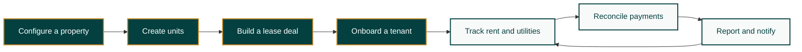
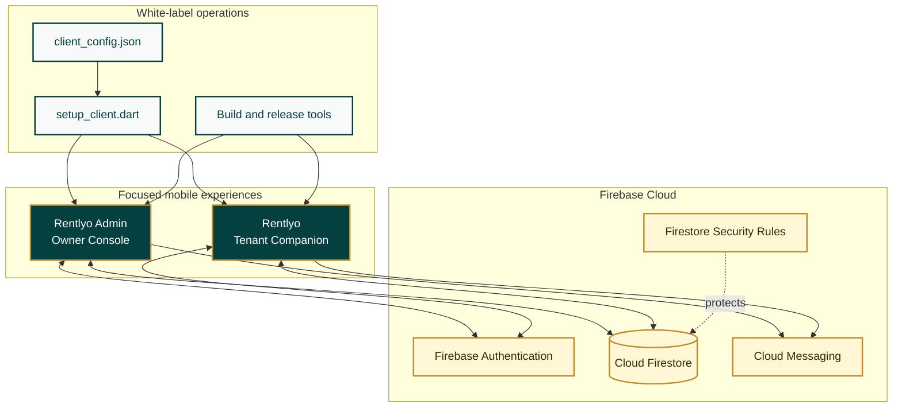
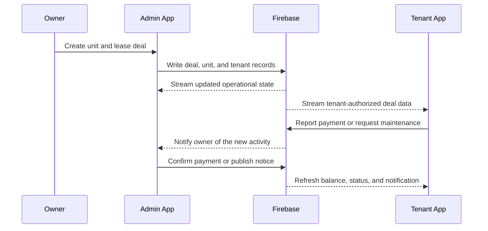

# Rentlyo

### The complete white-label property management suite for owners, managers, and tenants

[](https://flutter.dev/)
[](https://dart.dev/)
[](https://firebase.google.com/)
[](https://www.android.com/)
[](#license)

<p align="center">
  
</p>

<p align="center">
  <strong>Leases, ledgers, tenants, and properties in one living workspace.</strong><br>
  <sub>Built for commercial spaces, residential communities, and mixed-use properties.</sub>
</p>

Rentlyo is a complete, configurable property-management ecosystem built with Flutter and Firebase. It combines a tenant-facing mobile application, an owner and property-manager console, a shared real-time financial model, secure Firestore rules, and a one-click white-label deployment engine.

It is designed for commercial shops, residential flats, rooms, beds, and mixed-use properties where owners need reliable rent operations and tenants need a clear, trustworthy lease portal.

> **One platform. Two focused apps. One synchronized property workspace.**

<p align="center">
  <a href="#quick-start">Get Started</a> &nbsp; | &nbsp;
  <a href="#client-onboarding-and-white-label-setup">Deploy a Client</a> &nbsp; | &nbsp;
  <a href="#system-architecture">Explore the Architecture</a>
</p>

### The Rentlyo loop



---

## Contents

- [What Rentlyo Includes](#what-rentlyo-includes)
- [Why It Is Different](#why-it-is-different)
- [Product Capabilities](#product-capabilities)
- [System Architecture](#system-architecture)
- [Repository Layout](#repository-layout)
- [Technology Stack](#technology-stack)
- [Requirements](#requirements)
- [Quick Start](#quick-start)
- [Client Onboarding and White-Label Setup](#client-onboarding-and-white-label-setup)
- [Firebase Setup](#firebase-setup)
- [Application Workflows](#application-workflows)
- [Financial and Operational Engines](#financial-and-operational-engines)
- [Security Model](#security-model)
- [Build and Release](#build-and-release)
- [In-App Updates](#in-app-updates)
- [Database Operations](#database-operations)
- [Testing](#testing)
- [Troubleshooting](#troubleshooting)
- [Production Checklist](#production-checklist)
- [Documentation](#documentation)
- [License](#license)

---

## What Rentlyo Includes

### 1. Rentlyo Tenant App

A private lease and rent companion for renters, shopkeepers, and residential occupants.

- Live dashboard with current dues and advance balance
- Agreement and deal summary in plain language
- Rent schedules with step-up tiers
- Full payment and installment ledger
- Partial-payment and advance-adjustment tracking
- Payment reporting for cash, UPI, and installments
- One-tap UPI payment handoff to supported payment apps
- Payment receipt generation and WhatsApp sharing
- Utility bill and sub-meter history
- Digital gate passes and visitor-related workflows
- Property notices and announcements
- Push notifications and local rent reminders
- Secure PIN unlock and protected local storage
- In-app release update notifications

### 2. Rentlyo Admin Console

A focused operating console for property owners, managers, and accounting staff.

- Dashboard occupancy and vacancy overview
- Commercial and residential unit management
- Multi-unit deal creation and consolidation
- Tenant onboarding wizard
- Lease start dates, monthly rent, and escalation tiers
- Advance deposit and security management
- Advance top-ups with dates, amounts, and owner remarks
- Automatic ledger rebalancing after financial changes
- Payment confirmation and installment review
- Maintenance request management
- Electricity and water sub-meter billing
- Notices, announcements, and tenant communication
- Visitor logs and digital gate-pass administration
- Multi-property context switching
- Tenant credential generation without ending the admin session
- PDF statements, CSV exports, and Excel-compatible reporting
- Owner PIN authentication and secure local session handling
- App version publishing and OTA release management

### 3. White-Label Deployment Engine

A reusable deployment layer for preparing the same product for a new property, brand, or client.

- Central `client_config.json` configuration
- Automatic Firebase project and API-key discovery from `google-services.json`
- Brand name, app name, taglines, colors, contact details, UPI, and property identity
- Client logo and optional banner distribution
- Android package-name and app-label synchronization
- Adaptive launcher icon generation
- Native splash-screen generation
- Firebase owner-account bootstrap
- Firestore seed and verification workflow
- Pre-flight diagnostics
- Release APK compilation for both applications
- Database cleaning utility for test environments

<table>
<tr>
<td width="33%" valign="top">

#### For owners

Manage inventory, deals, deposits, payments, utilities, notices, and reports from one focused console.

</td>
<td width="33%" valign="top">

#### For tenants

See the lease, understand the balance, pay rent, report payments, receive notices, and access everyday property tools.

</td>
<td width="33%" valign="top">

#### For operators

Clone the platform for a new client with centralized configuration, branded assets, Firebase bootstrap, and release automation.

</td>
</tr>
</table>

---

## Why It Is Different

### Built around the real rent lifecycle

Rentlyo models the relationship between a property, its units, a lease deal, a tenant, an advance balance, monthly rent, payment records, utilities, and notices. The apps are not disconnected screens; they are two views of the same operational ledger.

### Real-time by default

Firestore streams keep deal information, advance top-ups, notices, payment states, and property branding synchronized between the admin and tenant experiences.

### White-label at the configuration layer

A new client can receive branded applications without rebuilding the product architecture from scratch. The setup engine distributes assets, rewrites generated configuration, prepares Firebase connectivity, and can build both release APKs from one workspace.

### Designed for mixed-use properties

Commercial and residential inventory can coexist while remaining separated during onboarding and vacancy selection. Multi-unit deals can be consolidated without losing unit-level occupancy state.

### Financial clarity over manual arithmetic

The shared rent engine handles advance consumption, partial payments, overdue carryover, rent escalations, and payment status reconciliation so owners and tenants see the same outcome.

---

## Product Capabilities

| Area | Tenant App | Admin Console |
| --- | :---: | :---: |
| Live rent balance | Yes | Yes |
| Lease and deal terms | Yes | Yes |
| Advance balance and top-ups | View | Manage |
| Payment ledger | View and report | Review and confirm |
| Rent escalation tiers | View | Configure |
| Unit inventory | View context | Manage |
| Tenant onboarding | No | Yes |
| Maintenance requests | Create and track | Manage |
| Utility billing | View history | Calculate and publish |
| Notices and announcements | Read | Create and manage |
| Gate passes and visitor logs | Use | Manage |
| Multi-property switching | Contextual | Yes |
| PDF/CSV/Excel reporting | No | Yes |
| Release update management | Receive | Publish |

---

## System Architecture



### Data flow principles

1. An owner creates properties, units, and lease deals in the Admin Console.
2. Firestore stores the canonical operational state.
3. The Tenant App reads only the tenant's permitted records through authenticated streams.
4. Payment, advance, utility, notice, and occupancy changes appear in both apps in real time.
5. Firestore rules enforce owner access and tenant ownership boundaries at the database layer.

### From setup to synchronized apps



---

## Repository Layout

```text
Rentlyo/
├── Rentlyo/                         # Tenant-facing Flutter application
│   ├── lib/
│   │   ├── core/                    # App configuration and shared tenant services
│   │   ├── models/                  # Tenant-side data models
│   │   ├── screens/                 # Tenant experience screens
│   │   ├── services/                # Firebase, ledger, notification, and update services
│   │   └── widgets/                 # Reusable tenant UI components
│   ├── assets/images/               # Tenant branding assets
│   ├── android/                     # Android project and Firebase configuration
│   ├── test/                        # Tenant tests
│   └── pubspec.yaml                 # Tenant dependencies and app metadata
│
├── Rentlyo Admin/                   # Owner and property-manager Flutter application
│   ├── lib/
│   │   ├── core/                    # Admin configuration and shared services
│   │   ├── models/                  # Admin-side data models
│   │   ├── screens/                 # Admin workflows and dashboards
│   │   ├── services/                # Firebase, reports, auth, ledger, and update services
│   │   └── widgets/                 # Reusable admin UI components
│   ├── assets/images/               # Admin branding assets
│   ├── android/                     # Android project and Firebase configuration
│   ├── test/                        # Admin tests
│   └── pubspec.yaml                 # Admin dependencies and app metadata
│
├── scripts/                         # Dart automation and operations tools
│   ├── setup_client.dart            # Client configuration and deployment engine
│   ├── bootstrap_admin.dart         # Owner authentication and initial data bootstrap
│   ├── clean_database.dart          # Controlled test-data purge utility
│   └── update_version.dart          # Firestore-backed release publisher
│
├── client_assets/                   # Client-supplied logo and Firebase config
├── assets/images/                   # Root-level shared image assets
├── client_config.json               # White-label configuration source
├── firestore.rules                  # Firestore authorization rules
├── setup_new_client.bat             # Windows one-click launcher
├── setup_new_client.ps1             # PowerShell launcher
└── MASTER_PRODUCTION_AND_CLIENT_DEPLOYMENT_GUIDE.md
```

> Build output folders such as `build/` and `.dart_tool/` are generated artifacts. Do not copy them into a new client workspace or commit them to source control.

---

## Technology Stack

### Client applications

- Flutter and Dart
- Material Design
- Firebase Core
- Firebase Authentication
- Cloud Firestore
- Firebase Cloud Messaging
- Local notifications
- Secure local storage
- Google Fonts
- URL launching for UPI, WhatsApp, and external actions
- PDF, CSV, and Excel-compatible report generation in the Admin Console
- Android adaptive icons and native splash screens

### Backend and operations

- Firebase Authentication with phone-number-to-pseudo-email mapping
- Cloud Firestore real-time document and collection streams
- Firestore Security Rules
- Firebase Cloud Messaging notifications
- GitHub-hosted or externally hosted APK release artifacts
- Dart command-line automation scripts
- Windows batch and PowerShell launchers

### Supported application targets

The current release configuration is optimized for Android APK distribution. The Flutter projects can be developed with standard Flutter tooling, but platform-specific Firebase configuration, signing, and release validation must be completed before targeting additional platforms.

---

## Requirements

Install the following before starting:

- Windows 10 or later for the provided `.bat` and PowerShell launchers
- Flutter SDK with Dart 3.x
- Android Studio and Android SDK for Android builds
- A configured Android emulator or physical Android device for local runs
- A Firebase project with Authentication and Cloud Firestore enabled
- Git, recommended for source control and release management

Verify the toolchain:

```powershell
flutter doctor
flutter --version
 dart --version
```

If `dart` is not available as a standalone command, the launchers can use the Dart runtime bundled with Flutter.

---

## Quick Start

### 1. Fetch dependencies

```powershell
cd "Rentlyo"
flutter pub get

cd "..\Rentlyo Admin"
flutter pub get
```

### 2. Configure Firebase

Place the correct Firebase Android configuration in each app's Android module, or place a source copy at:

```text
client_assets/google-services.json
```

The deployment tooling can distribute the Firebase configuration to both applications.

### 3. Run the apps

Tenant application:

```powershell
cd "Rentlyo"
flutter run
```

Admin application:

```powershell
cd "..\Rentlyo Admin"
flutter run
```

### 4. Run tests

```powershell
cd "..\Rentlyo"
flutter test

cd "..\Rentlyo Admin"
flutter test
```

For the complete client setup flow, use the root-level launcher described below.

---

## Client Onboarding and White-Label Setup

Rentlyo is structured so a new client or property can be prepared from one workspace.

### Required client inputs

Place the following in `client_assets/`:

```text
client_assets/
├── google-services.json     # Firebase Android configuration
├── logo.png                # Square client logo
└── banner.png              # Optional property banner
```

Update `client_config.json` with the new client's:

- Property and brand identity
- App names and taglines
- Address and support contacts
- Owner UPI ID
- Primary, secondary, accent, and background colors
- Firebase project settings where needed
- Default property ID and currency
- Owner bootstrap phone and initial password
- Android package identifiers

### One-click launcher

From the repository root, run:

```powershell
.\setup_new_client.ps1
```

Or double-click:

```text
setup_new_client.bat
```

The launcher provides these operations:

| Option | Operation |
| --- | --- |
| `1` | Complete client setup, asset distribution, branding, Firebase bootstrap |
| `2` | Complete setup and build both release APKs |
| `3` | Pre-flight diagnostics and health check |
| `4` | Interactive configuration questionnaire |
| `5` | Clean or reset test data while retaining the owner account |
| `6` | Exit |

The underlying Dart commands are also available directly:

```powershell
# Complete setup
 dart scripts/setup_client.dart

# Complete setup plus both release APKs
 dart scripts/setup_client.dart --all

# Verify keys, assets, package identifiers, and connectivity
 dart scripts/setup_client.dart --verify

# Configure a client interactively
 dart scripts/setup_client.dart --interactive
```

The setup engine can:

- Detect Firebase project details from `google-services.json`
- Copy Firebase configuration into both apps
- Distribute logos and banners
- Rewrite generated app configuration
- Apply client branding and contact information
- Update Android package IDs and labels
- Generate launcher icons and splash screens
- Bootstrap the initial owner account
- Seed or verify the initial Firestore property state
- Build release APKs when requested

For the full operational walkthrough, read [MASTER_PRODUCTION_AND_CLIENT_DEPLOYMENT_GUIDE.md](MASTER_PRODUCTION_AND_CLIENT_DEPLOYMENT_GUIDE.md).

---

## Firebase Setup

For a fresh client backend:

1. Create a Firebase project.
2. Enable Email/Password authentication.
3. Create a Cloud Firestore database in production mode.
4. Publish the rules from [firestore.rules](firestore.rules).
5. Register the Admin and Tenant Android applications.
6. Download `google-services.json`.
7. Place it in `client_assets/` and run the verification or setup command.

### Authentication model

Rentlyo uses an internal pseudo-email mapping so users can sign in with a mobile number and password while using Firebase Email/Password authentication:

```text
9876543210 -> 9876543210@rentlyo.local
```

The mapping is an implementation detail. The user experience remains a mobile-number login, while Firebase handles authentication and token issuance.

### Core Firestore collections

| Collection | Purpose |
| --- | --- |
| `users` | Owner and tenant profiles, roles, and renter relationships |
| `properties` | Property identity, branding, contacts, and configuration |
| `units` | Shops, flats, rooms, beds, and occupancy state |
| `deals` | Lease terms, rent schedules, deposits, and tenant links |
| `paymentRecords` | Monthly rent records, installments, and payment states |
| `maintenanceRequests` | Tenant issues and owner resolution workflows |
| `notices` | Property-wide and tenant-facing announcements |
| `utilityBills` | Electricity and water sub-meter charges |
| `gatePasses` | Digital tenant and visitor passes |
| `visitorLogs` | Entry and exit activity |
| `messMenus` | Optional mess or canteen menu data |
| `notifications` | User-targeted alerts and notification state |
| `appVersions` | Latest version, minimum version, download URL, and notes |

---

## Application Workflows

### Owner workflow

1. Complete Firebase setup and run client bootstrap.
2. Sign in to the Admin Console with the configured owner mobile number and initial password.
3. Set a personal six-digit unlock PIN.
4. Create properties and units.
5. Add a lease deal using the onboarding wizard.
6. Choose commercial or residential inventory and select one or more units.
7. Configure rent, deposit behavior, start date, escalation tiers, and agreement documents.
8. Share tenant credentials.
9. Confirm payments, manage advances, publish notices, and review reports.

### Tenant workflow

1. Install the Tenant App.
2. Sign in using the mobile number and password provided by the owner.
3. Set a personal six-digit unlock PIN.
4. Review the dashboard, agreement, current balance, and payment history.
5. Pay through the configured UPI handoff or report an offline/partial payment.
6. Review utilities, notices, maintenance requests, gate passes, and receipts.

### Multi-unit and multi-property workflow

- Multi-unit deals are consolidated under one active lease while each selected unit remains represented in occupancy data.
- Secondary units in a consolidated deal are marked occupied and removed from vacant selection.
- Commercial and residential unit types remain isolated during onboarding.
- Owners can switch property context from the Admin Console without maintaining separate application installations.

---

## Financial and Operational Engines

### Rent and advance reconciliation

The shared rent engine supports:

- Monthly due calculation
- Partial-payment carryover
- Overdue balance accumulation
- Advance balance consumption
- Advance top-ups
- Payment status reconciliation
- Rent step-up tiers over time
- Current-period settlement visibility

Typical payment states include:

```text
confirmed-paid
adjusted-against-advance
pending-confirmation
confirmed-partial
overdue
```

### Utility billing

For electricity and water sub-meters:

```text
units consumed = current reading - previous reading
utility charge  = units consumed x rate per unit
monthly total   = rent + utility charge + applicable adjustments
```

The Admin Console can publish utility charges while the Tenant App exposes the resulting history and statement context.

### Notifications

Automated notification logic can:

- Notify tenants about the rent cycle
- Reflect whether rent is paid, partially paid, overdue, or covered by advance
- Remove obsolete overdue alerts after settlement
- Publish owner-authored property notices
- Deliver app release prompts when a newer version is available

### Live property branding

Property-level settings can be stored in Firestore so contact details, UPI information, and selected branding values can be reflected through cloud configuration. Changes must still be tested carefully in production because they affect the tenant experience immediately.

---

## Security Model

The repository includes Firestore rules that enforce role and ownership boundaries.

- Unauthenticated users cannot access protected operational records.
- Owners can manage properties, units, deals, payments, notices, utilities, and administrative records.
- Tenants can read records connected to their own renter identity.
- Tenants can create permitted payment, maintenance, and gate-pass records.
- Tenant updates are restricted to records associated with their authenticated identity.
- Owner-only deletion protects core administrative data from tenant-side removal.
- Public reads are limited to intentional launch and branding use cases such as property configuration and app-version checks.

Review [firestore.rules](firestore.rules) before every production deployment. Security rules are part of the application boundary, not an optional deployment detail.

### Credential and secret handling

Do not commit real credentials, private keys, owner passwords, or client Firebase configuration to a public repository.

Before publishing this project publicly:

1. Remove or rotate any real Firebase API keys and owner credentials present in local configuration.
2. Keep client-specific `google-services.json` files private.
3. Add local-only configuration files to `.gitignore` where appropriate.
4. Use a sanitized example configuration for documentation and onboarding.
5. Change bootstrap passwords immediately after first owner login.
6. Treat database reset and bootstrap commands as privileged operations.
7. Validate Firestore rules with a separate test Firebase project before production rollout.

Firebase web API keys are not substitutes for access control. Authentication, Firestore rules, package signing, and operational credential hygiene must all be maintained.

---

## Build and Release

### Debug builds

```powershell
cd "Rentlyo"
flutter build apk --debug

cd "..\Rentlyo Admin"
flutter build apk --debug
```

### Release builds

```powershell
cd "Rentlyo"
flutter build apk --release

cd "..\Rentlyo Admin"
flutter build apk --release
```

Or from the root launcher:

```powershell
.\setup_new_client.ps1
# Choose option 2
```

### APK locations

```text
Rentlyo/build/app/outputs/flutter-apk/app-release.apk
Rentlyo Admin/build/app/outputs/flutter-apk/app-release.apk
```

Before distributing an APK, verify:

- The app label and package ID are correct.
- The client logo and splash screen are correct.
- The Firebase project is the intended client project.
- The release is signed with the correct key.
- Login works for both owner and tenant roles.
- Firestore rules reject unauthorized reads and writes.
- UPI, WhatsApp, notifications, file downloads, and update prompts work on a real device.

---

## In-App Updates

The `appVersions` collection allows the apps to check for new releases and show update prompts.

Publish a release with:

```powershell
dart scripts/update_version.dart `
  rentlyo_renter `
  1.0.1 `
  2 `
  1.0.0 `
  "https://github.com/OWNER/REPOSITORY/releases/download/v1.0.1/renter.apk" `
  "Bug fixes and improvements"
```

For the Admin Console, use `rentlyo_admin` as the app ID:

```powershell
dart scripts/update_version.dart rentlyo_admin 1.0.1 2 1.0.0 "https://example.com/admin.apk" "Release notes"
```

The command authenticates as the owner and updates the release document with:

- Latest semantic version
- Build number
- Minimum required version
- APK download URL
- Release notes

Only publish URLs that are stable, accessible to the intended users, and protected by your release process.

---

## Database Operations

The database cleaner is intended for development, demo, and test reset scenarios. It removes transactional and temporary records while retaining the owner account and property branding document.

```powershell
# Interactive reset
 dart scripts/clean_database.dart

# Keep units while cleaning transactional records
 dart scripts/clean_database.dart --keep-units

# Non-interactive reset; use only in a controlled environment
 dart scripts/clean_database.dart --force
```

The reset operation can remove deals, payment records, units, maintenance requests, utility bills, gate passes, visitor logs, menus, notifications, notices, and non-owner user profiles. Confirm the target Firebase project before running it.

---

## Testing

Tenant tests:

```powershell
cd "Rentlyo"
flutter test
```

Admin tests:

```powershell
cd "..\Rentlyo Admin"
flutter test
```

The test suites cover important areas such as:

- Rent and advance calculation
- Model behavior
- Security-related model constraints
- Unit-type separation
- Widget behavior
- Admin workflows

For production releases, supplement unit and widget tests with a real-device acceptance pass against a non-production Firebase project.

---

## Troubleshooting

| Symptom | Resolution |
| --- | --- |
| `setup_client.dart` not found | Run the launcher from the repository root and keep `scripts/` beside the launcher. |
| Dart or Flutter not found | Install Flutter, add it to `PATH`, then run `flutter doctor`. |
| Owner login fails | Run the complete setup or bootstrap flow and verify the Firebase project and owner credentials. |
| Firebase project mismatch | Replace `client_assets/google-services.json`, verify `client_config.json`, and run `--verify`. |
| No units appear | Check the selected property context in the Admin Console and verify the unit documents in Firestore. |
| Wrong branding appears | Update `client_config.json` and assets, then run the complete client setup again. |
| APK cannot install | Check Android signing, package ID, device compatibility, and Play Protect warnings for sideloaded APKs. |
| Updates do not appear | Verify the `appVersions` document, minimum version, APK URL, and Firestore read rules. |
| Reset command is blocked | Use the interactive confirmation or provide `--force` only after verifying the target project. |

When diagnosing a client deployment, run the pre-flight check first:

```powershell
dart scripts/setup_client.dart --verify
```

---

## Production Checklist

### Configuration

- [ ] Client name, brand name, property ID, address, and currency are correct.
- [ ] App names, taglines, colors, logo, and optional banner are correct.
- [ ] Support phone, WhatsApp number, email, and UPI ID are correct.
- [ ] Firebase project and Android package identifiers are correct.

### Backend

- [ ] Email/Password authentication is enabled.
- [ ] Firestore is in the intended region and mode.
- [ ] Current [firestore.rules](firestore.rules) are published.
- [ ] Owner bootstrap completed successfully.
- [ ] No test tenant records remain.
- [ ] No client secrets are exposed in source control.

### Application

- [ ] Owner login and PIN unlock work.
- [ ] Tenant login and PIN unlock work.
- [ ] Commercial/residential unit separation works.
- [ ] Multi-unit deal occupancy is correct.
- [ ] Rent, advance, partial payment, and overdue calculations are correct.
- [ ] Utility billing and receipts are correct.
- [ ] Notices, notifications, maintenance, gate passes, and visitor logs work.
- [ ] UPI and WhatsApp handoffs work on a real device.
- [ ] Release APKs are signed and versioned.
- [ ] Update metadata points to the correct artifacts.

---

## Documentation

- [Master production and deployment guide](MASTER_PRODUCTION_AND_CLIENT_DEPLOYMENT_GUIDE.md)
- [Tenant application README](Rentlyo/README.md)
- [Admin Console README](Rentlyo%20Admin/README.md)
- [Firestore security rules](firestore.rules)
- [Client configuration](client_config.json)

The app-specific READMEs contain screen-level feature notes. This root README documents the complete suite, its operating model, and its deployment lifecycle.

---

## License

This project is private and proprietary software unless a separate written license says otherwise. The source code, branding, configuration, deployment scripts, Firebase rules, and generated client applications may not be redistributed, resold, or deployed for another party without authorization from the project owner.

---

<div align="center">

### Rentlyo

**Clear leases. Reliable ledgers. Better property operations.**

Built as a complete, configurable property-management platform for the real world.

</div>
